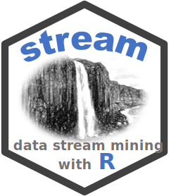

#  R package streamConnect - Connecting Stream Mining Components Using Sockets and Web Services

[](https://mhahsler.r-universe.dev/streamConnect)
[](https://CRAN.R-project.org/package=streamConnect)
[](https://CRAN.R-project.org/package=streamConnect)

The R package is part of the
[stream](https://github.com/mhahsler/stream) ecosystem. It adds
functionality to connect stream mining components from package stream
using sockets and Web services. The package can be used create
distributed workflows and create plumber-based Web services which can be
deployed on most common cloud services.

To cite package ‘streamConnect’ in publications use:

> Hahsler M (????). *streamConnect: Connecting Stream Mining Components
> Using Sockets and Web Services*. R package version 0.0-6.1.

    @Manual{,
      title = {streamConnect: Connecting Stream Mining Components Using Sockets and Web Services},
      author = {Michael Hahsler},
      note = {R package version 0.0-6.1},
    }

## Installation

**Stable CRAN version:** Install from within R with

``` r
install.packages("streamConnect")
```

**Current development version:** Install from
[r-universe.](https://mhahsler.r-universe.dev/streamConnect)

``` r
install.packages("streamConnect",
    repos = c("https://mhahsler.r-universe.dev",
              "https://cloud.r-project.org/"))
```

## Examples

See [stream: Working With Data Streams using Connections and Web
Services](https://CRAN.R-project.org/package=streamConnect/vignettes/connections.html)
for examples.

## Acknowledgements

The development of the stream package was supported in part by NSF CMMI
1728612.

## References

Michael Hahsler, Matthew Bolaños, and John Forrest. [stream: An
extensible framework for data stream clustering research with
R.](https://dx.doi.org/10.18637/jss.v076.i14) *Journal of Statistical
Software,* 76(14), February 2017.
